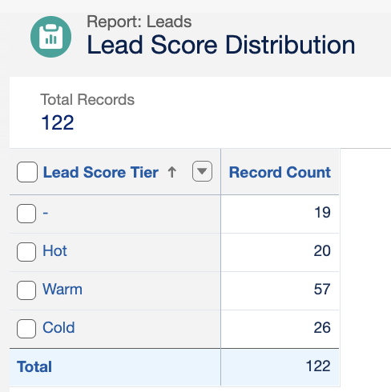
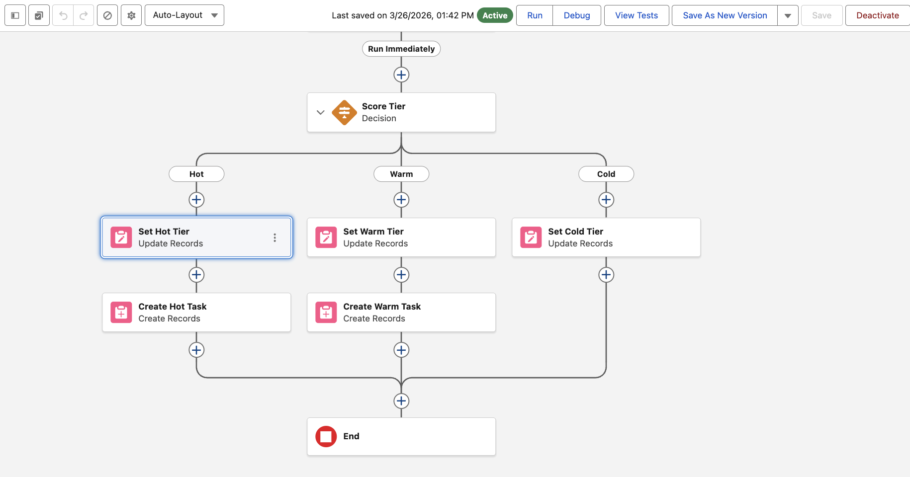
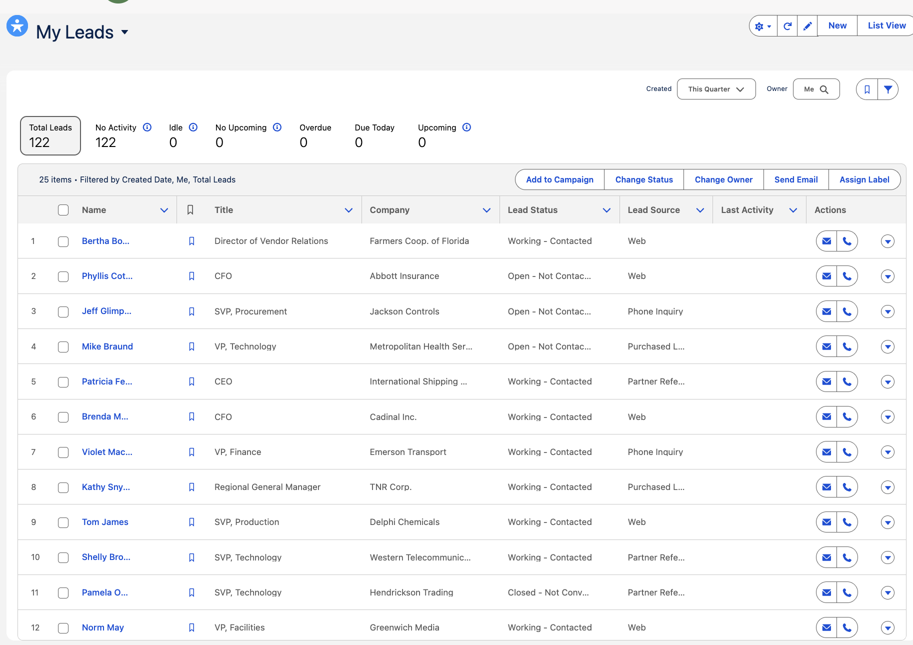

# Salesforce Lead Routing & Scoring Pipeline

A production-style RevOps automation that scores inbound leads with a Python ML model and syncs results directly into Salesforce CRM — triggering native Record-Triggered Flows that route hot leads to a queue and create SDR follow-up tasks automatically.

Built to demonstrate the full CRM integration loop: **data seeding → ML scoring → bidirectional SFDC sync → automated workflow execution** — with no manual steps between lead creation and task assignment.

---

## What It Does

```
Python pipeline                         Salesforce Developer Org
──────────────────────────────────────────────────────────────────────────
1. Seed 100 mock leads  ────────────►  Lead records created via REST API
2. SOQL query           ◄────────────  Fetch leads back with field data
3. Logistic regression                 Score 0–100 per lead
4. Bulk write scores    ────────────►  Lead_Score__c updated (bulk API)
                                       │
                                       ▼
                              Record-Triggered Flow fires
                                       │
                         ┌─────────────┼─────────────┐
                         ▼             ▼              ▼
                    Score ≥ 75    Score 50–74    Score < 50
                      HOT            WARM           COLD
                         │             │
                    Assign to     Create Task:
                  Hot Leads Queue  "Schedule
                  + Task: "Follow   discovery
                   up in 24h"      call"
```

**Scoring model** — logistic regression trained on 1,000 synthetic records with four features:
- Lead source quality (Referral > Web > Event > Paid Ad > Cold Outbound)
- Industry fit weight (Technology/FinServ = highest, Non-Profit = lowest)
- Log-scaled employee count
- Log-scaled annual revenue

---

## Tech Stack

| Layer | Tool |
|---|---|
| CRM | [Salesforce Developer Org](https://developer.salesforce.com/signup) |
| Python ↔ SFDC | [simple_salesforce](https://github.com/simple-salesforce/simple-salesforce) |
| ML model | [scikit-learn](https://scikit-learn.org/) — LogisticRegression |
| Workflow automation | Salesforce Record-Triggered Flow (Flow Builder) |
| Data | pandas · faker |

---

## Project Structure

```
salesforce-lead-routing-pipeline/
├── scripts/
│   ├── score_and_sync.py          # Main pipeline: seed → score → sync
│   └── generate_training_data.py  # Generates synthetic labeled training data
├── salesforce/
│   └── Lead_Routing_Flow.flow-meta.xml  # SFDC Flow definition (importable)
├── screenshots/                   # Dashboard and Flow screenshots
├── .env.example                   # Credentials template
├── requirements.txt
└── README.md
```

---

## Setup

### 1. Salesforce Developer Org

1. Sign up at [developer.salesforce.com/signup](https://developer.salesforce.com/signup) (free)
2. Add custom fields to the **Lead** object (`Setup → Object Manager → Lead → Fields`):
   - `Lead_Score__c` — Number, length 3, decimal places 0
   - `Lead_Score_Tier__c` — Picklist with values: `Hot`, `Warm`, `Cold`
3. Create a Queue named **"Hot Leads Queue"** (`Setup → Queues`, supported object: Lead)
4. Import the Flow (`Setup → Flows → New Flow → Import`) using `salesforce/Lead_Routing_Flow.flow-meta.xml`
   - Update the `REPLACE_WITH_HOT_LEADS_QUEUE_ID` placeholder with your actual Queue ID
   - Activate the Flow
5. Get your Security Token: `Avatar → Settings → My Personal Information → Reset My Security Token`

### 2. Python Environment

```bash
git clone https://github.com/romanlicursi/salesforce-lead-routing-pipeline
cd salesforce-lead-routing-pipeline
pip install -r requirements.txt
cp .env.example .env
# fill in SF_USERNAME, SF_PASSWORD, SF_SECURITY_TOKEN in .env
```

### 3. Run the Pipeline

```bash
# Generate training data (run once)
python scripts/generate_training_data.py

# Run the full pipeline
python scripts/score_and_sync.py
```

Expected output:
```
════════════════════════════════════════════════════════════
Salesforce Lead Scoring & Routing Pipeline
════════════════════════════════════════════════════════════
Loading cached model from data/model.joblib
Connecting to Salesforce as ... (domain: login)
Connected. Instance: na1.salesforce.com

Seeding 100 mock leads into Salesforce…
  Created 100/100 leads successfully.

Fetching 100 leads via SOQL…
Fetched 100 records.

Score distribution — Hot: 28  Warm: 34  Cold: 38
Writing 100 scores back to Salesforce (bulk API)…
  Updated 100/100 records successfully.

Pipeline complete.
The native SFDC Record-Triggered Flow will now:
  • Set Lead_Score_Tier__c (Hot / Warm / Cold)
  • Assign Hot leads to 'Hot Leads Queue'
  • Create follow-up Tasks for Hot and Warm leads
```

---

## Salesforce Dashboard

Three reports combined into one **"RevOps Lead Pipeline"** dashboard in SFDC:

| Report | Chart | Insight |
|---|---|---|
| Lead Score Distribution | Bar — count by tier | Hot/Warm/Cold volume at a glance |
| Lead Source vs. Avg Score | Bar — avg score per source | Which acquisition channels yield highest-quality leads |
| Open Tasks by Lead Tier | Summary table | SDR workload by tier |



Screenshots in `/screenshots/`.

---

## Screenshots

**Flow Builder — Lead Routing Logic**


**Lead Records — Seeded via Python Pipeline**


---

## Verification Checklist

- [ ] Run `score_and_sync.py` end to end — confirm 100 Lead records have `Lead_Score__c` populated in SFDC
- [ ] Manually update one Lead's `Lead_Score__c` to 80 — confirm Flow fires: `Lead_Score_Tier__c` = Hot, Task created, Owner = Hot Leads Queue
- [ ] Set score to 60 — confirm Warm tier + discovery call Task
- [ ] Set score to 30 — confirm Cold tier, no Task
- [ ] Open SFDC Dashboard — confirm all 3 reports render

---

## Why This Project

I already had a lead scoring model sitting in a repo doing nothing after it ran. The obvious next question was: what's the point of a score if it lives in a CSV?

I wanted to learn how Salesforce actually works at the API level, not just click through Trailhead. So I connected the Python scoring logic directly to a real Salesforce org, wrote the scores back via the bulk API, and built a Flow that does something with them. The whole thing runs start to finish without touching the browser.

Related: [lead-scoring-automation](https://github.com/romanlicursi/lead-scoring-automation) — the standalone scoring system this project extends into Salesforce.
